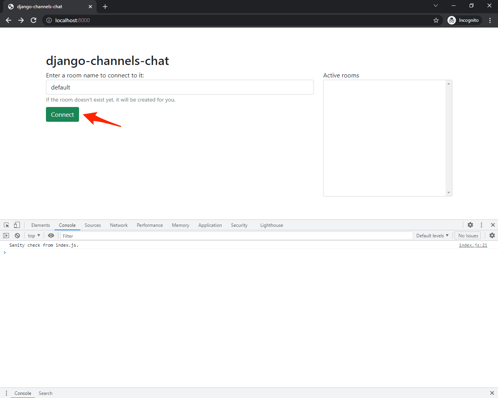

# Intro. to Django Channels

## What is Django Channels?

[Django Channels](https://channels.readthedocs.io/en/stable/) extends the built-in capabilities of Django allowing Django projects to handle not only HTTP but also protocols that require long-running connections, such as WebSockets, MQTT (IoT), chatbots, radios, and other real-time applications. On top of this, it provides support for a number of Django's core features like authentication and sessions.

A basic Channels setup looks something like this:


## Sync vs Async
Because of the differences between Channels and Django, we'll have to frequently switch between sync and async code execution. For example, the Django database needs to be accessed using synchronous code while the Channels channel layer needs to be accessed using asynchronous code.

The easiest way to switch between the two is by using the built-in Django [asgiref](https://github.com/django/asgiref) (asgrief.sync) functions:

1. `sync_to_async` - takes a sync function and returns an async function that wraps it
2. `async_to_sync` - takes an async function and returns a sync function

-----------------------------------------------------------
## Project Setup for `Chat app`

1. The app will have multiple rooms where Django authenticated users can chat. 
2. Each room will have a list of currently connected users. 
3. Private, one-to-one messaging should be possible, too.

* Create django-project and django-app, and install libraries
```cmd
mkdir django-channels-example && cd django-channels-example
python3.9 -m venv venv
source venv/bin/activate
pip install django==4.0
django-admin startproject core .
python manage.py startapp chat
```

* `core/settings.py`
```python
INSTALLED_APPS = [
    'django.contrib.admin',
    'django.contrib.auth',
    'django.contrib.contenttypes',
    'django.contrib.sessions',
    'django.contrib.messages',
    'django.contrib.staticfiles',
    'chat.apps.ChatConfig',  # new
]
```

### Create Database Models

1. `Room` represents a chat room. It contains an `online` field for tracking when users connect and disconnect from the chat room.
2. `Message` represents a message sent to the chat room. We'll use this model to store all the messages sent in the chat.

* *chat/models.py*:
```python
from django.contrib.auth.models import User
from django.db import models


class Room(models.Model):
    name = models.CharField(max_length=128)
    online = models.ManyToManyField(to=User, blank=True)

    def get_online_count(self):
        return self.online.count()

    def join(self, user):
        self.online.add(user)
        self.save()

    def leave(self, user):
        self.online.remove(user)
        self.save()

    def __str__(self):
        return f'{self.name} ({self.get_online_count()})'


class Message(models.Model):
    user = models.ForeignKey(to=User, on_delete=models.CASCADE)
    room = models.ForeignKey(to=Room, on_delete=models.CASCADE)
    content = models.CharField(max_length=512)
    timestamp = models.DateTimeField(auto_now_add=True)

    def __str__(self):
        return f'{self.user.username}: {self.content} [{self.timestamp}]'
```

* Migrate the models
```
python manage.py makemigrations
python manage.py migrate
```

* Register the models in *chat/admin.py* so they're accessible from the Django admin panel:

```python
from django.contrib import admin

from chat.models import Room, Message

admin.site.register(Room)
admin.site.register(Message)
```

### Views and URLs

The web application will have the following two URLs:

1. `/chat/` - chat room selector
2. `/chat/<ROOM_NAME>/` - chat room

* *chat/views.py*:

```python
from django.shortcuts import render

from chat.models import Room


def index_view(request):
    return render(request, 'index.html', {
        'rooms': Room.objects.all(),
    })


def room_view(request, room_name):
    chat_room, created = Room.objects.get_or_create(name=room_name)
    return render(request, 'room.html', {
        'room': chat_room,
    })
```

* *chat/urls.py*
```python
from django.urls import path

from . import views

urlpatterns = [
    path('', views.index_view, name='chat-index'),
    path('<str:room_name>/', views.room_view, name='chat-room'),
]
```

* *core/urls.py*
```python
from django.contrib import admin
from django.urls import path, include

urlpatterns = [
    path('chat/', include('chat.urls')),  
    path('admin/', admin.site.urls),
]
```


### Templates and Static Files

* Create an *index.html* file inside a new folder called "templates" in "chat":
```html
<!-- chat/templates/index.html -->



<!DOCTYPE html>
<html lang="en">
    <head>
        <title>django-channels-chat</title>
        <link rel="stylesheet" href="https://cdn.jsdelivr.net/npm/bootstrap@5.1.3/dist/css/bootstrap.min.css">
        <script src="https://cdn.jsdelivr.net/npm/bootstrap@5.1.3/dist/js/bootstrap.min.js"></script>
        <style>
            #roomSelect {
                height: 300px;
            }
        </style>
    </head>
    <body>
        <div class="container mt-3 p-5">
            <h2>django-channels-chat</h2>
            <div class="row">
                <div class="col-12 col-md-8">
                    <div class="mb-2">
                        <label for="roomInput">Enter a room name to connect to it:</label>
                        <input type="text" class="form-control" id="roomInput" placeholder="Room name">
                        <small id="roomInputHelp" class="form-text text-muted">If the room doesn't exist yet, it will be created for you.</small>
                    </div>
                    <button type="button" id="roomConnect" class="btn btn-success">Connect</button>
                </div>
                <div class="col-12 col-md-4">
                    <label for="roomSelect">Active rooms</label>
                    <select multiple class="form-control" id="roomSelect">
                        
                            <option>{{ room }}</option>
                        
                    </select>
                </div>
            </div>
        </div>
        <script src=""></script>
    </body>
</html>
```

* Next, add *room.html* inside the same folder:

```html
<!-- chat/templates/room.html -->



<!DOCTYPE html>
<html lang="en">
    <head>
        <title>django-channels-chat</title>
        <link rel="stylesheet" href="https://cdn.jsdelivr.net/npm/bootstrap@5.1.3/dist/css/bootstrap.min.css">
        <script src="https://cdn.jsdelivr.net/npm/bootstrap@5.1.3/dist/js/bootstrap.min.js"></script>
        <style>
            #chatLog {
                height: 300px;
                background-color: #FFFFFF;
                resize: none;
            }

            #onlineUsersSelector {
                height: 300px;
            }
        </style>
    </head>
    <body>
        <div class="container mt-3 p-5">
            <h2>django-channels-chat</h2>
            <div class="row">
                <div class="col-12 col-md-8">
                    <div class="mb-2">
                        <label for="chatLog">Room: #{{ room.name }}</label>
                        <textarea class="form-control" id="chatLog" readonly></textarea>
                    </div>
                    <div class="input-group">
                        <input type="text" class="form-control" id="chatMessageInput" placeholder="Enter your chat message">
                        <div class="input-group-append">
                            <button class="btn btn-success" id="chatMessageSend" type="button">Send</button>
                        </div>
                    </div>
                </div>
                <div class="col-12 col-md-4">
                    <label for="onlineUsers">Online users</label>
                    <select multiple class="form-control" id="onlineUsersSelector">
                    </select>
                </div>
            </div>
            {{ room.name|json_script:"roomName" }}
        </div>
        <script src=""></script>
    </body>
</html>
```

> To make our code more readable, we'll include the JavaScript code in separate files -- index.js and room.js, respectively. Because we can't access the Django context in JavaScript, we can use the [json_script](https://docs.djangoproject.com/en/4.0/ref/templates/builtins/#json-script) template tag to store room.name and then fetch it in the JavaScript file.

* Inside "chat", create a folder called "static". Then, inside "static", create an *index.js* and a *room.js* file.

```js
// chat/static/index.js

console.log("Sanity check from index.js.");

// focus 'roomInput' when user opens the page
document.querySelector("#roomInput").focus();

// submit if the user presses the enter key
document.querySelector("#roomInput").onkeyup = function(e) {
    if (e.keyCode === 13) {  // enter key
        document.querySelector("#roomConnect").click();
    }
};

// redirect to '/room/<roomInput>/'
document.querySelector("#roomConnect").onclick = function() {
    let roomName = document.querySelector("#roomInput").value;
    window.location.pathname = "chat/" + roomName + "/";
}

// redirect to '/room/<roomSelect>/'
document.querySelector("#roomSelect").onchange = function() {
    let roomName = document.querySelector("#roomSelect").value.split(" (")[0];
    window.location.pathname = "chat/" + roomName + "/";
}
```

```js
// chat/static/room.js

console.log("Sanity check from room.js.");

const roomName = JSON.parse(document.getElementById('roomName').textContent);

let chatLog = document.querySelector("#chatLog");
let chatMessageInput = document.querySelector("#chatMessageInput");
let chatMessageSend = document.querySelector("#chatMessageSend");
let onlineUsersSelector = document.querySelector("#onlineUsersSelector");

// adds a new option to 'onlineUsersSelector'
function onlineUsersSelectorAdd(value) {
    if (document.querySelector("option[value='" + value + "']")) return;
    let newOption = document.createElement("option");
    newOption.value = value;
    newOption.innerHTML = value;
    onlineUsersSelector.appendChild(newOption);
}

// removes an option from 'onlineUsersSelector'
function onlineUsersSelectorRemove(value) {
    let oldOption = document.querySelector("option[value='" + value + "']");
    if (oldOption !== null) oldOption.remove();
}

// focus 'chatMessageInput' when user opens the page
chatMessageInput.focus();

// submit if the user presses the enter key
chatMessageInput.onkeyup = function(e) {
    if (e.keyCode === 13) {  // enter key
        chatMessageSend.click();
    }
};

// clear the 'chatMessageInput' and forward the message
chatMessageSend.onclick = function() {
    if (chatMessageInput.value.length === 0) return;
    // TODO: forward the message to the WebSocket
    chatMessageInput.value = "";
};
```

* final "chat" app directory structure should now look like this:
```
chat
├── __init__.py
├── admin.py
├── apps.py
├── migrations
│   ├── 0001_initial.py
│   ├── __init__.py
├── models.py
├── static
│   ├── index.js
│   └── room.js
├── templates
│   ├── index.html
│   └── room.html
├── tests.py
├── urls.py
└── views.py
```


### Test

* Start the Django development server:

```cmd
python manage.py runserver
```

Navigate to http://localhost:8000/chat/. You'll see the room selector:



To ensure that the static files are configured correctly, open the 'Developer Console'. You should see the sanity check:

-----------------------------------------------------------
## Set Channels

* Install channels

```cmd
pip install channels==3.0.4
```

Then, add channels to your INSTALLED_APPS inside core/settings.py:

# core/settings.py
```python
INSTALLED_APPS = [
    'django.contrib.admin',
    'django.contrib.auth',
    'django.contrib.contenttypes',
    'django.contrib.sessions',
    'django.contrib.messages',
    'django.contrib.staticfiles',
    'chat.apps.ChatConfig',
    'channels', 
]
```

> Since we'll be using WebSockets instead of HTTP to communicate from the client to the server, we need to wrap our ASGI config with [ProtocolTypeRouter](https://channels.readthedocs.io/en/latest/topics/routing.html#protocoltyperouter) in *core/asgi.py*:

* *core/asgi.py*:

```python
import os

from channels.routing import ProtocolTypeRouter
from django.core.asgi import get_asgi_application

os.environ.setdefault('DJANGO_SETTINGS_MODULE', 'core.settings')

application = ProtocolTypeRouter({
  'http': get_asgi_application(),
})
```

This router will route traffic to different parts of the web application depending on the protocol used.

> Django versions <= 2.2 don't have built-in ASGI support. 


* Django need to know the location of our ASGI application. Add the following to your *core/settings.py* file, just below the WSGI_APPLICATION setting:

```python
# core/settings.py

WSGI_APPLICATION = 'core.wsgi.application'
ASGI_APPLICATION = 'core.asgi.application'  # new
```

### Add Channel Layer

A [channel layer](https://channels.readthedocs.io/en/stable/topics/channel_layers.html) is a kind of a communication system, which allows multiple parts of our application to exchange messages, without shuttling all the messages or events through the database.

We need a channel layer to give consumers the ability to talk to one another. While we could use the [InMemoryChannelLayer](https://channels.readthedocs.io/en/stable/topics/channel_layers.html#in-memory-channel-layer) layer since we're in development mode, we'll use a production-ready layer, [RedisChannelLayer](https://channels.readthedocs.io/en/stable/topics/channel_layers.html#redis-channel-layer).

* Run reids using docker

```cmd 
docker run -p 6379:6379 -d redis:5
```

* To connect to Redis from Django, we need to install an additional package called channels_redis:
```cmd
pip install channels_redis==3.3.1
```

* After that, configure the layer in *core/settings.py* like so:
```python
# core/settings.py

CHANNEL_LAYERS = {
    'default': {
        'BACKEND': 'channels_redis.core.RedisChannelLayer',
        'CONFIG': {
            "hosts": [('127.0.0.1', 6379)],
        },
    },
}
```

* To test if everything works as expected, open the Django shell:

```sh
python manage.py shell

>>> import channels.layers
>>> channel_layer = channels.layers.get_channel_layer()
>>>
>>> from asgiref.sync import async_to_sync
>>> async_to_sync(channel_layer.send)('test_channel', {'type': 'hello'})
>>> async_to_sync(channel_layer.receive)('test_channel')
{'type': 'hello'}
```

Here, we connected to the channel layer using the settings defined in *core/settings.py*. We then used `channel_layer.send` to send a message to the `test_channel` group and `channel_layer.receive` to read all the messages sent to the same group.

> Take note that we wrapped all the function calls in async_to_sync because the channel layer is asynchronous.


### Add Channels Consumer

A [consumer](https://channels.readthedocs.io/en/stable/topics/consumers.html) is the basic unit of Channels code. They are tiny ASGI applications, driven by events. They are akin to Django views. ***However, unlike Django views, consumers are long-running by default and Django project can have multiple consumers that are combined using Channels routing***.

Each consumer has it's own scope, which is a set of details about a single incoming connection. They contain pieces of data like protocol type, path, headers, routing arguments, user agent, and more.

* *chat/consumers.py*:
```python
import json

from asgiref.sync import async_to_sync
from channels.generic.websocket import WebsocketConsumer

from .models import Room

class ChatConsumer(WebsocketConsumer):

    def __init__(self, *args, **kwargs):
        super().__init__(args, kwargs)
        self.room_name = None
        self.room_group_name = None
        self.room = None

    def connect(self):
        self.room_name = self.scope['url_route']['kwargs']['room_name']
        self.room_group_name = f'chat_{self.room_name}'
        self.room = Room.objects.get(name=self.room_name)

        # connection has to be accepted
        self.accept()

        # join the room group
        async_to_sync(self.channel_layer.group_add)(
            self.room_group_name,
            self.channel_name,
        )

    def disconnect(self, close_code):
        async_to_sync(self.channel_layer.group_discard)(
            self.room_group_name,
            self.channel_name,
        )

    def receive(self, text_data=None, bytes_data=None):
        text_data_json = json.loads(text_data)
        message = text_data_json['message']

        # send chat message event to the room
        async_to_sync(self.channel_layer.group_send)(
            self.room_group_name,
            {
                'type': 'chat_message',
                'message': message,
            }
        )

    def chat_message(self, event):
        self.send(text_data=json.dumps(event))
```

`WebsocketConsumer` provides three methods, `connect()`, `disconnect()`, and `receive()`:

1. Inside `connect()` we called `accept()` in order to accept the connection. After that, we added the user to the channel layer group.
2. Inside `disconnect()`, we removed the user from the channel layer group.
3. Inside `receive()`, we parsed the data to JSON and extracted the message. Then, we forwarded the message using group_send to chat_message.

> When using channel layer's `group_send`, your consumer has to have a method for every JSON message type you use. In our situation, `type` is equaled to `chat_message`. Thus, we added a method called `chat_message`.

> If you use dots in your message types, Channels will automatically convert them to underscores when looking for a method -- e.g, `chat.message` will become `chat_message`.


Since `WebsocketConsumer` is a synchronous consumer, we had to call `async_to_sync` when working with the channel layer. We decided to go with a sync consumer since the chat app is closely connected to Django (which is sync by default). In other words, we wouldn't get a performance boost by using an async consumer.

> You should use sync consumers by default. What's more, only use async consumers in cases where you're absolutely certain that you're doing something that would benefit from async handling (e.g., long-running tasks that could be done in parallel) and you're only using async-native libraries.

### Add Channels Routing

Channels provides different [routing](https://channels.readthedocs.io/en/stable/topics/routing.html) classes which allow us to combine and stack consumers. They are similar to Django's URLs.

* *chat/routing.py*:

```python
from django.urls import re_path

from . import consumers

websocket_urlpatterns = [
    re_path(r'ws/chat/(?P<room_name>\w+)/$', consumers.ChatConsumer.as_asgi()),
]
```
* *core/asgi.py*:

```python
import os

from channels.routing import ProtocolTypeRouter, URLRouter
from django.core.asgi import get_asgi_application

import chat.routing

os.environ.setdefault('DJANGO_SETTINGS_MODULE', 'core.settings')

application = ProtocolTypeRouter({
  'http': get_asgi_application(),
  'websocket': URLRouter(
      chat.routing.websocket_urlpatterns
    ),
})
```

## WebSockets (frontend)

[WebSockets API](https://developer.mozilla.org/en-US/docs/Web/API/WebSocket) are extremely easy to use. First, you need to establish a connection by providing a `url` and then you can listen for the following events:

1. `onopen` - called when a WebSocket connection is established
2. `onclose` - called when a WebSocket connection is destroyed
3. `onmessage` - called when a WebSocket receives a message
4. `onerror` - called when a WebSocket encounters an error

* To integrate WebSockets into the application, add the following to the bottom of *room.js*:
```js
// chat/static/room.js
let chatSocket = null;

function connect() {
    chatSocket = new WebSocket("ws://" + window.location.host + "/ws/chat/" + roomName + "/");

    chatSocket.onopen = function(e) {
        console.log("Successfully connected to the WebSocket.");
    }

    chatSocket.onclose = function(e) {
        console.log("WebSocket connection closed unexpectedly. Trying to reconnect in 2s...");
        setTimeout(function() {
            console.log("Reconnecting...");
            connect();
        }, 2000);
    };

    chatSocket.onmessage = function(e) {
        const data = JSON.parse(e.data);
        console.log(data);

        switch (data.type) {
            case "chat_message":
                chatLog.value += data.message + "\n";
                break;
            default:
                console.error("Unknown message type!");
                break;
        }

        // scroll 'chatLog' to the bottom
        chatLog.scrollTop = chatLog.scrollHeight;
    };

    chatSocket.onerror = function(err) {
        console.log("WebSocket encountered an error: " + err.message);
        console.log("Closing the socket.");
        chatSocket.close();
    }
}
connect();
```

After establishing the WebSocket connection, in the `onmessage` event, we determined the message type based on `data.type`. Take note how we wrapped the WebSocket inside the `connect()` method to have the ability to re-establish the connection in case it drops.

* Lastly, change the TODO inside `chatMessageSend.onclickForm` to the following:

```js
// chat/static/room.js

chatSocket.send(JSON.stringify({
    "message": chatMessageInput.value,
}));
```

* The full handler should now look like this:

```js
// chat/static/room.js

chatMessageSend.onclick = function() {
    if (chatMessageInput.value.length === 0) return;
    chatSocket.send(JSON.stringify({
        "message": chatMessageInput.value,
    }));
    chatMessageInput.value = "";
};
```

To test, run the development server. Then, open two private/incognito browser windows and, in each, navigate to http://localhost:8000/chat/default/. You should be able to send a messages:


